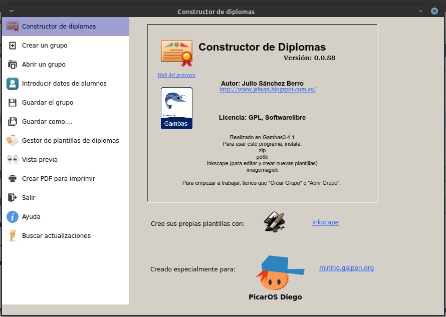
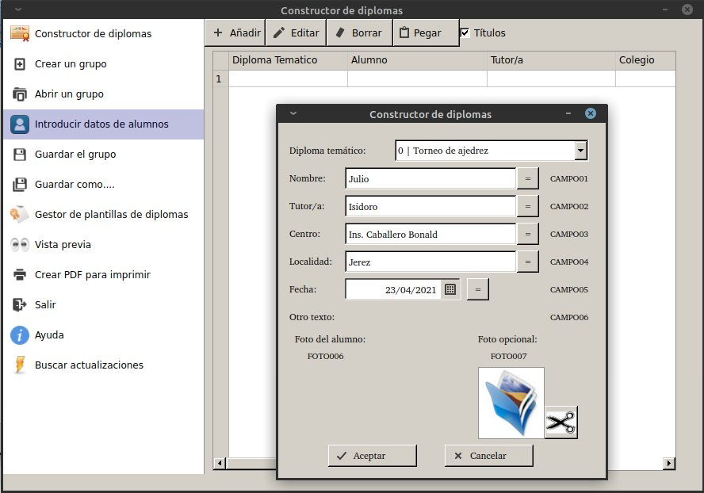
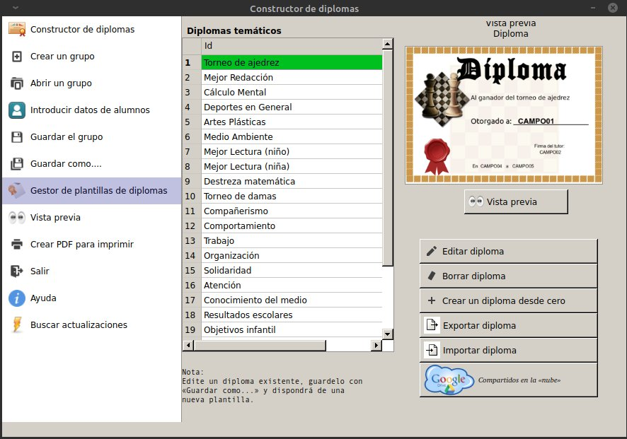
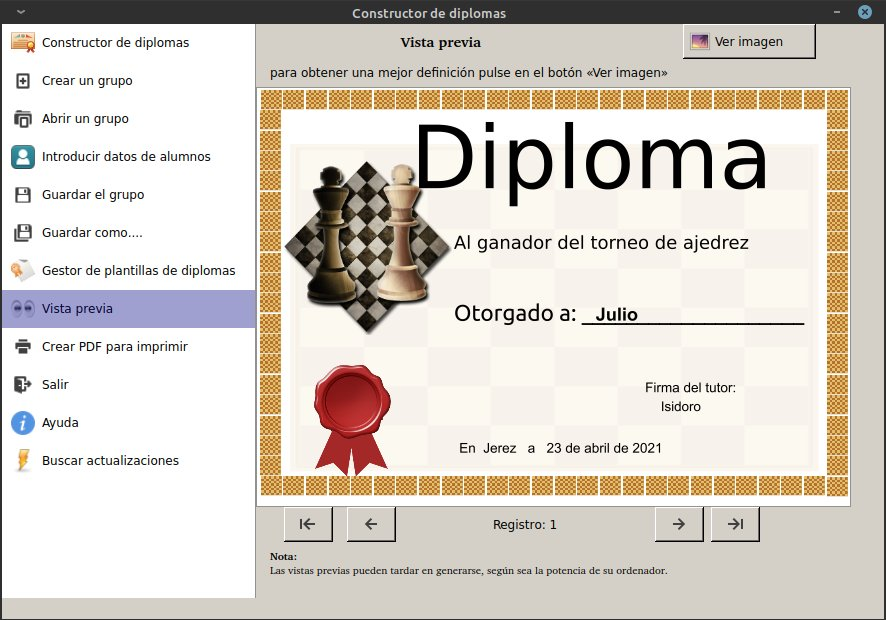
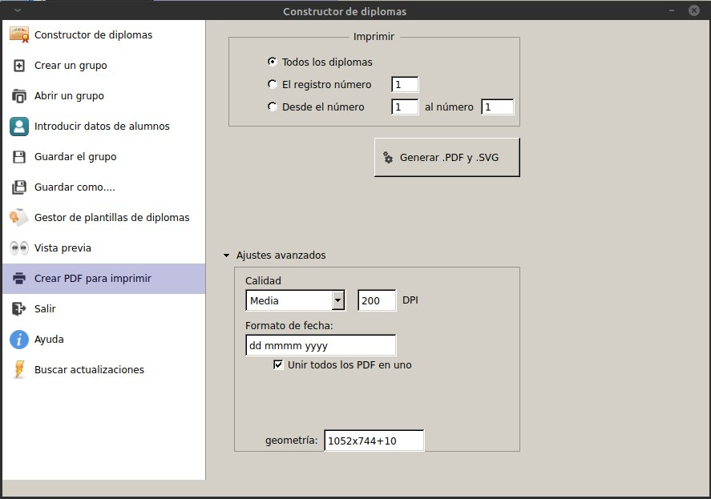

# Constructor de Diplomas

Genera facilmente diplomas para tus alumnos.



Crea grupo de alumnos y Añade los datos de los alumnos:


Gestor de plantillas disponibles:


Vista previa disponible para que veas como quedan los diplomas rellenados:


Genera los diplomas  en formato pdf y .svg (editables por el programa inkscape):



### Pre-requisitos 📋

Debes de tener instalado gambas3.15.
Puedes usar el PPA:

```
sudo add-apt-repository ppa:gambas-team/gambas3  
sudo apt-get update
sudo apt-get install gambas3
```

### Instalación 🔧

Puedes seguir los pasos indicados en este [enlace][enlace]:

[enlace]: https://gist.github.com/Nando98/2cd5fc89cb7cfbe9b5fba56220d05307

## Autores ✒️

* **Julio Sanchez Berro** 

## Licencia 📄

GPLv3
